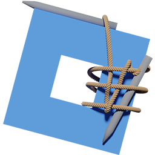

# Knit



**[Under Development]**

A lightweight framework for Roblox that simplifies communication between core parts of your game and seamlessly bridges the gap between the server and the client.

[Read the documentation](https://sleitnick.github.io/Knit/) for more info.

-------------------

Knit gives developers the tools to create services/controllers on the server and client. These services and controllers can talk to each other seamlessly, including serialization/de-serialization of custom classes.

## Using Knit

To use Knit, both the server and the client will look like this:

```lua
-- Load core module:
local Knit = require(game:GetService("ReplicatedStorage").Knit)

----
-- Load services or controllers here
----

-- Start Knit:
Knit.Start():Then(function()
	print("Knit running")
end):Catch(function(err)
	warn(err)
end)
```
